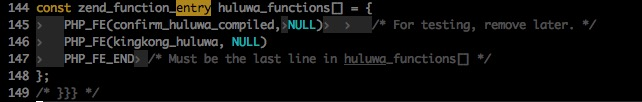

### Why
C是静态编译的，执行效率比PHP代码高很多。同样的运算代码，使用C来开发，性能会比PHP要提升数百倍。但如果是IO操作如CURL，因为耗时主要在IOWait上，C扩展没有明显优势。

另外C扩展是在进程启动时加载的，PHP代码只能操作Request生命周期的数据，C扩展可操作的范围更广。

### How 
1. 下载PHP的源代码，解压后进入ext目录，比如我们要写一个huluwa的扩展，执行`./ext_skel --extname=huluwa`，如下图：

2. 执行完后会在当前目录生成一个目录，文件结构如下图：

3. 其中，config.m4是AutoConf工具的配置文件，用来修改各种编译选项。修改config.m4，将

        dnl PHP_ARG_WITH(huluwa, for huluwa support,
        dnl Make sure that the comment is aligned:
        dnl [  --with-huluwa             Include huluwa support])

    修改为

        PHP_ARG_WITH(huluwa, for huluwa support,
        [  --with-huluwa             Include huluwa support])

4. 比如我们要在huluwa扩展中实现一个名为`kingkong_huluwa`的扩展函数，我们需要修改php_huluwa.h，在其中增加一行`PHP_FUNCTION(kingkong_huluwa);`，表示声明了一个`kingkong_huluwa`的扩展函数：

5. 修改huluwa.c，这里是扩展函数的实现部分：

    这里将函数指针注册到Zend引擎，增加一行PHP_FE(myext_helloworld,  NULL)（后面不要带分号）。

    在myext.c末尾加`kingkong_huluwa`的执行代码：

    `zend_parse_parameters`是用来接受PHP传入的参数，`RETVAL_TRUE`宏是用来返回给PHP数据。
    
6. 接下来我们运行如下命令：

        $ phpize
        $ ./configure
        $ make
        $ make install

    phpize命令是用来准备PHP扩展库的编译环境的。如果报一个找不到sed命令的错误，需要编辑phpize，将sed命令的路径改为当前环境下sed的路径：

7. 成功的安装将创建huluwa并放置于PHP的扩展库目录中。需要修改php.ini，加入 `extension=huluwa.so`这一行之后才能使用此扩展库。

8. 最后，执行`php -r "kingkong_huluwa('hello');"`测试：

    
### Reference
1. [如何编写一个PHP的C扩展](http://rango.swoole.com/archives/152)
2. [用phpize编译共享PECL扩展库](http://php.net/manual/zh/install.pecl.phpize.php)
3. [php-src](https://github.com/php/php-src)
